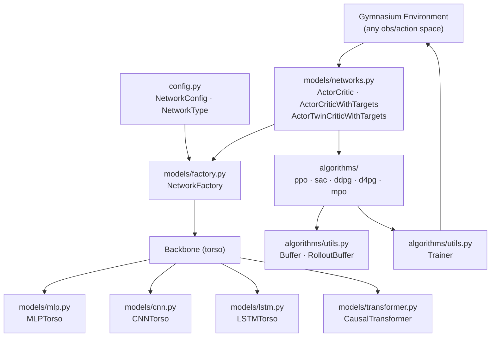

# torch-rl-algorithms

Clean PyTorch implementations of PPO, SAC, D4PG, DDPG and MPO with modular backbone architectures. Built for robot locomotion, works anywhere.

---

## Algorithms

| Algorithm | Type | Key paper |
|---|---|---|
| **PPO** | On-policy, stochastic | [Schulman et al. 2017](https://arxiv.org/abs/1707.06347) |
| **SAC** | Off-policy, stochastic, entropy-regularized | [Haarnoja et al. 2018](https://arxiv.org/abs/1801.01290) |
| **DDPG** | Off-policy, deterministic | [Lillicrap et al. 2015](https://arxiv.org/abs/1509.02971) |
| **D4PG** | Off-policy, deterministic, distributional critic | [Barth-Maron et al. 2018](https://arxiv.org/abs/1804.08617) |
| **MPO** | Off-policy, E-step/M-step, per-dim KL constraints | [Abdolmaleki et al. 2018](https://arxiv.org/abs/1806.06920) |

---

## Architecture



---

## Backbone Architectures

| Backbone | Class | Use case |
|---|---|---|
| MLP | `MLPTorso` | Flat observations (proprioception) |
| CNN | `CNNTorso` | History of observations as 1-D signal |
| LSTM | `LSTMTorso` | Sequential observations, variable-length history |
| Causal Transformer | `TransformerTorso` | Long history with positional encoding |

All backbones share the same `Torso` base class and plug into `NetworkFactory`. Switch architectures via `NetworkConfig(network_type=NetworkType.TRANSFORMER, ...)` without touching the algorithm code.

---

## Installation

### Standalone

```bash
pip install -e .
```

For GPU training (strongly recommended), install the CUDA build of PyTorch from [pytorch.org](https://pytorch.org/get-started/locally/) first:

```bash
pip install torch --index-url https://download.pytorch.org/whl/cu121
pip install -e .
```

### As a Git submodule

```bash
# Add to your project
git submodule add <repo-url> torch-rl-algorithms
git submodule update --init

# Install so your project can import from it
pip install -e torch-rl-algorithms/
```

Imports work exactly as if the code were local - no path hacks needed:

```python
from algorithms.sac.model import SAC
from models.networks import ActorCriticWithTargets
```

---

## Quickstart

```python
import gymnasium as gym
from algorithms.sac.model import SAC

env = gym.make("Pendulum-v1")
model = SAC(env, device="cuda")
model.train(steps=500_000)
```

Switch algorithm:

```python
from algorithms.ppo.model import PPO
from algorithms.d4pg.model import D4PG
from algorithms.ddpg.model import DDPG
from algorithms.mpo.model import MPO
```

---

## Configuration

Network architecture is configured via `NetworkConfig`. All fields are optional - defaults give a standard MLP actor-critic.

```python
from config import NetworkConfig, NetworkType

# MLP (default)
config = NetworkConfig(
    network_type=NetworkType.MLP,
    hidden_sizes=[256, 256],
)

# CNN over observation history
config = NetworkConfig(
    network_type=NetworkType.CNN,
    hidden_sizes=[256, 256],
    cnn_sizes=[[3, 32, 2], [3, 32, 2]],  # [kernel, channels, stride] per layer
)

# LSTM
config = NetworkConfig(
    network_type=NetworkType.LSTM,
    hidden_size=256,
    num_layers=2,
)

# Causal Transformer
config = NetworkConfig(
    network_type=NetworkType.TRANSFORMER,
    d_model=128,
    nhead=4,
    num_layers=2,
    dim_feedforward=256,
)
```

Pass separate configs for actor and critic:

```python
model = SAC(
    env,
    config={
        "model": {
            "actor_config": NetworkConfig(network_type=NetworkType.MLP, hidden_sizes=[256, 256]).model_dump(),
            "critic_config": NetworkConfig(network_type=NetworkType.TRANSFORMER, d_model=128, nhead=4, num_layers=2, dim_feedforward=256).model_dump(),
        }
    },
)
```

See [config.py](config.py) for the full schema and [examples/train_gymnasium.py](examples/train_gymnasium.py) for a runnable reference.

---

## Repository Layout

```
torch-rl-algorithms/
├── examples/
│   └── train_gymnasium.py  # Runnable config + algorithm examples
├── algorithms/
│   ├── ddpg/
│   │   ├── ddpg.py       # DDPG + DeterministicPolicyGradient + DeterministicQLearning
│   │   └── model.py      # DDPG entry point (wraps networks + algorithm)
│   ├── d4pg/
│   │   ├── d4pg.py       # D4PG (distributional critic, inherits DDPG)
│   │   └── model.py
│   ├── sac/
│   │   ├── sac.py        # SAC (twin critics, entropy regularization, inherits DDPG)
│   │   └── model.py
│   ├── mpo/
│   │   ├── mpo.py        # MPO (E-step / M-step, per-dim KL, ExpectedSARSA critic)
│   │   └── model.py
│   ├── ppo/
│   │   ├── ppo.py        # PPO (clipped surrogate, GAE, rollout buffer)
│   │   ├── buffer.py     # RolloutBuffer with GAE computation
│   │   └── model.py
│   └── utils.py          # Buffer, Trainer, NoiseModels, MeanStd, Model base class
├── models/
│   ├── mlp.py            # MLPTorso, MLPActor, MLPCritic
│   ├── cnn.py            # CNNTorso, CNNActor, CNNCritic
│   ├── lstm.py           # LSTMTorso, LSTMActor, LSTMCritic
│   ├── transformer.py    # CausalTransformer, TransformerTorso, TransformerActor, TransformerCritic
│   ├── networks.py       # ActorCritic, ActorCriticWithTargets, ActorTwinCriticWithTargets
│   ├── factory.py        # NetworkFactory - builds actor/critic from NetworkConfig
│   └── utils/
│       └── base.py       # Torso, Head (abstract base classes)
├── config.py             # NetworkType, NetworkConfig (pydantic schemas)
├── requirements.txt
└── LICENSE
```

---

## Design Decisions

- **DDPG as base class** - SAC and D4PG extend `DDPG`. The step/update loop, replay buffer, and exploration handling live once in DDPG; subclasses only override the actor/critic updaters.
- **Separate actor and critic updaters** - Each updater is a callable object (`DeterministicPolicyGradient`, `TwinCriticSoftQLearning`, etc.) with its own optimizer. Makes it easy to swap loss functions without touching the training loop.
- **NetworkFactory** - Decouples architecture choice from algorithm code. Pass `NetworkConfig` to get the right actor/critic regardless of backbone type.
- **Observation normalizer** - All torsos accept an optional `MeanStd` normalizer that updates online during training. No preprocessing pipeline needed.
- **Dict observation spaces** - All algorithms handle both flat `Box` and `Dict` observation spaces (e.g. separate actor/critic observations for privileged critic setups).

---

## Notes

- The `Trainer` class in `algorithms/utils.py` expects a Gymnasium-compatible environment with a `start()` / `step()` interface used in vectorized Isaac Lab environments. For standard Gymnasium envs, a thin wrapper is needed.

---

## License

[MIT](LICENSE)
